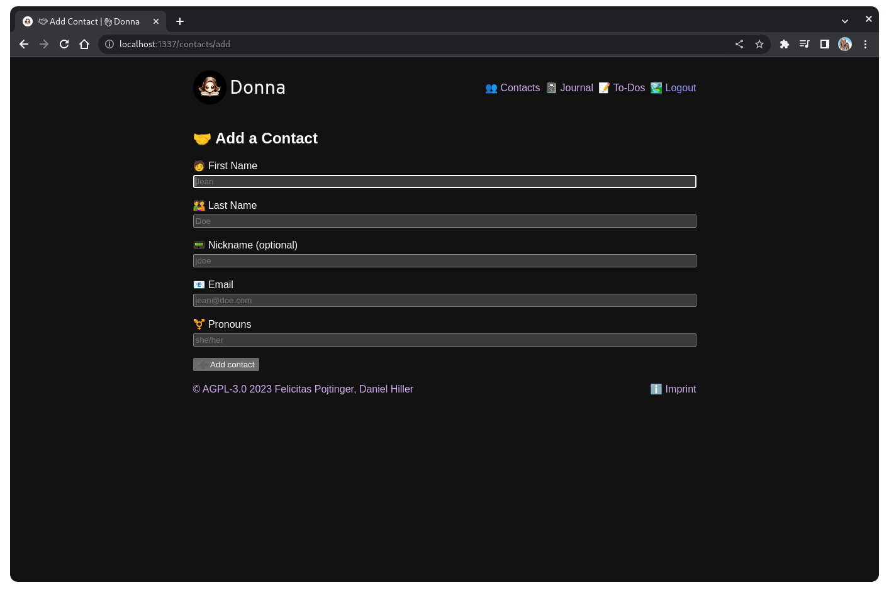
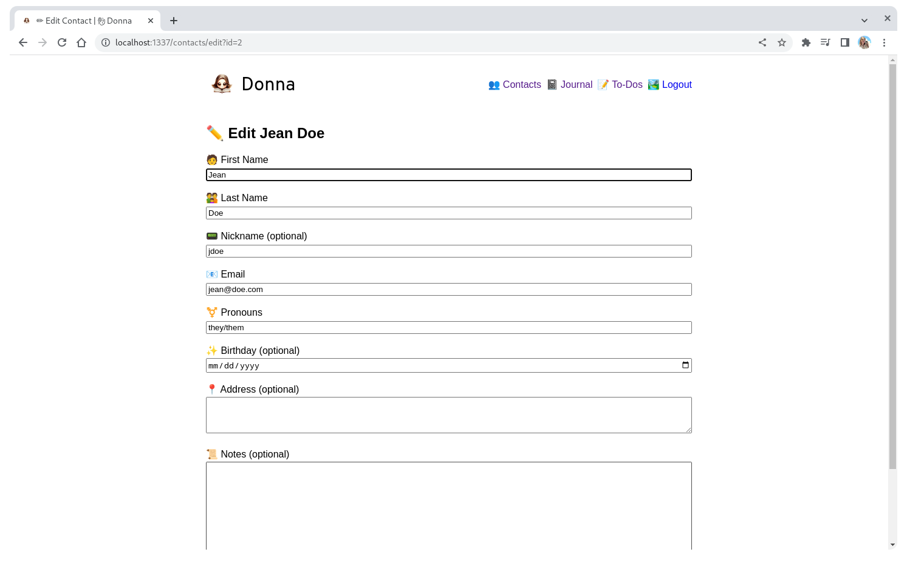
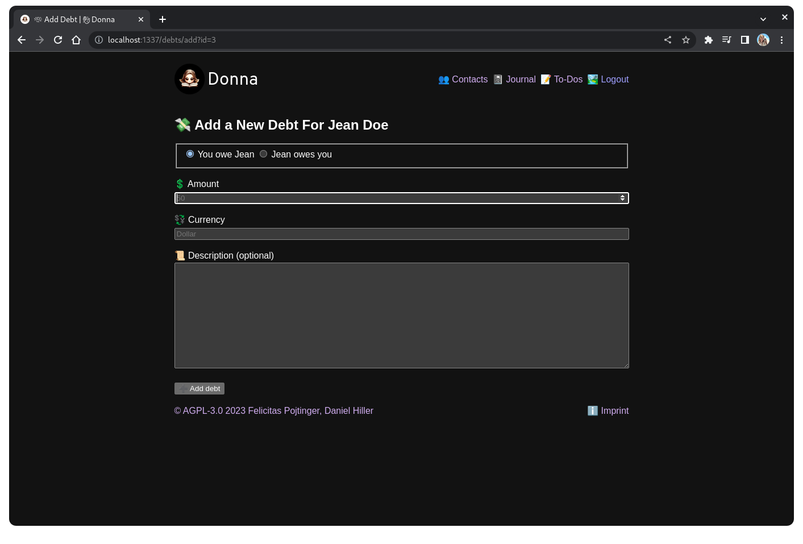
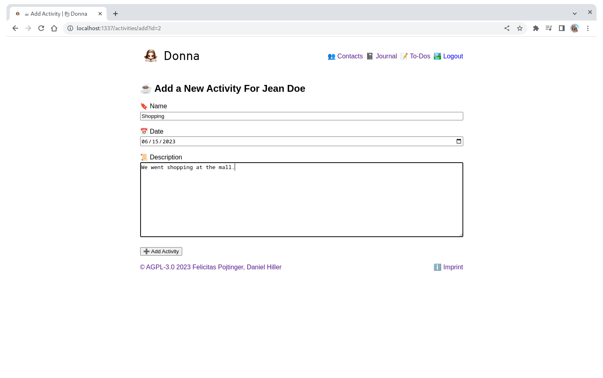
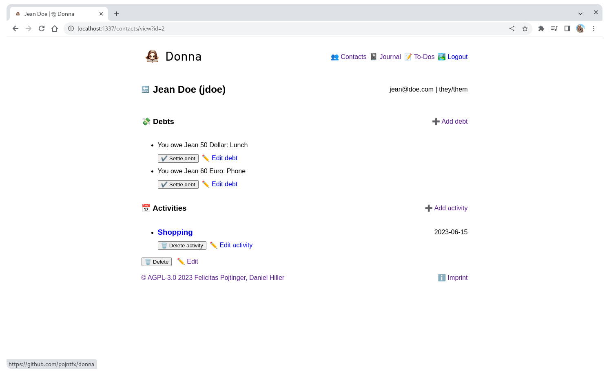
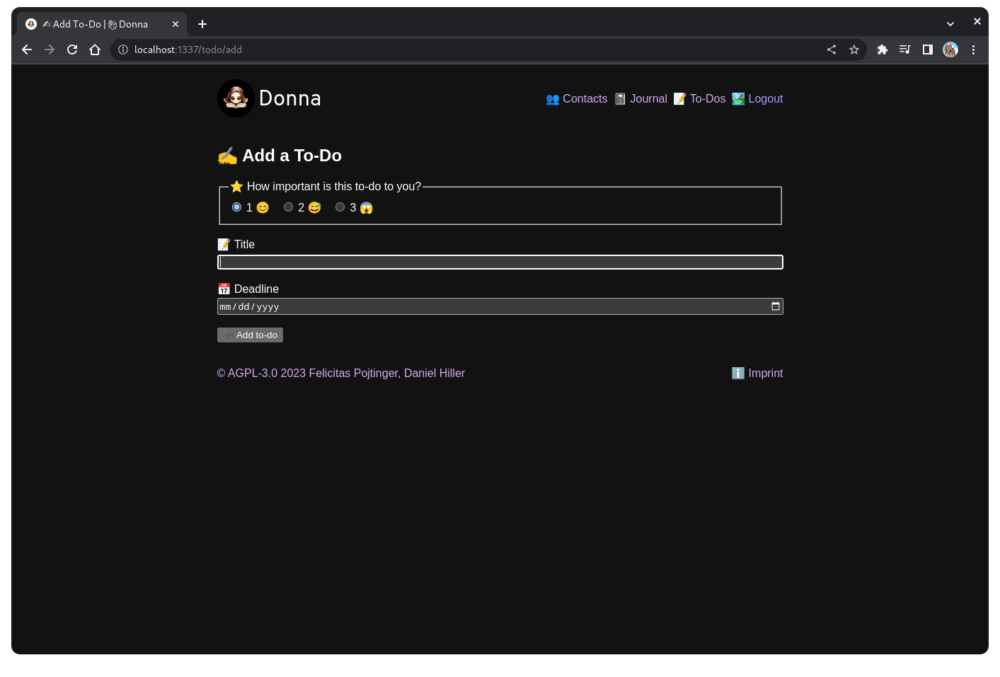
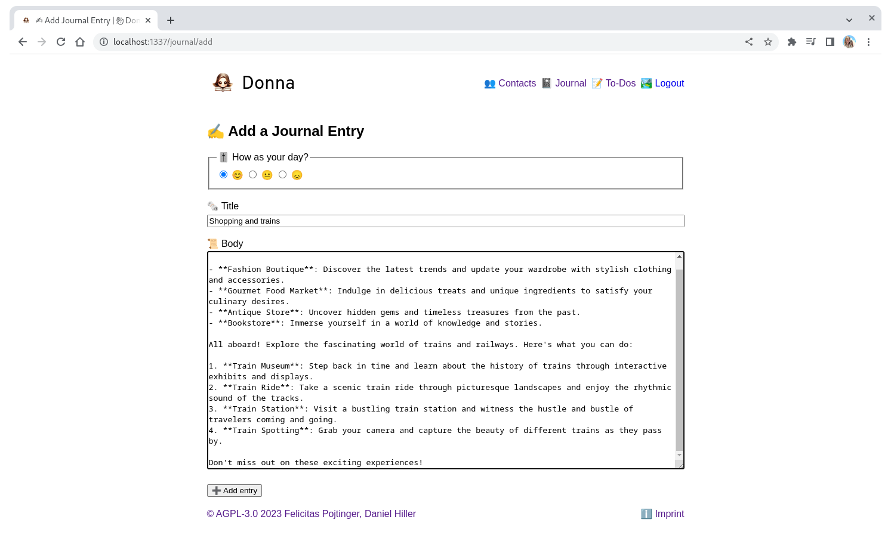
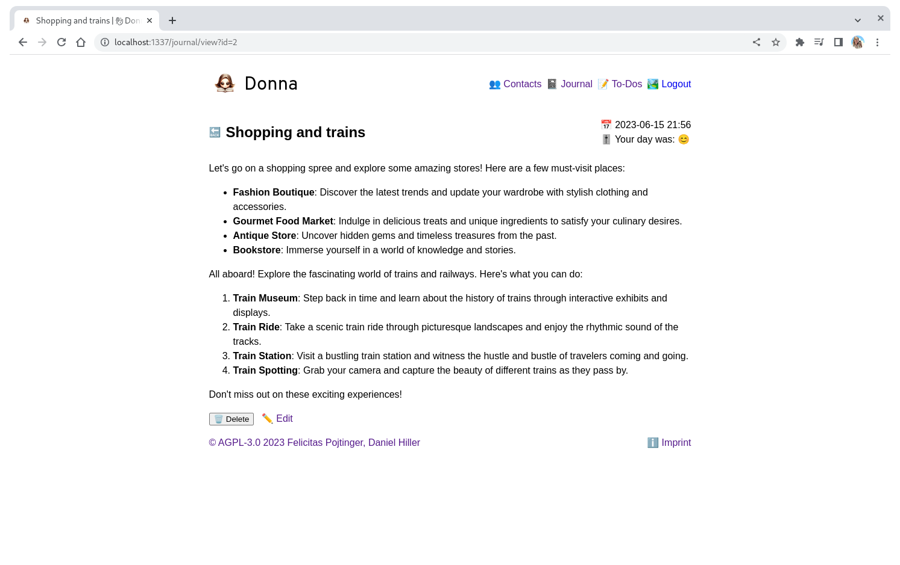

# Donna

Minimal personal CRM.

[](https://github.com/pojntfx/donna/actions/workflows/hydrun.yaml)
[](https://github.com/pojntfx/donna/actions/workflows/docker.yaml)

[](https://pkg.go.dev/github.com/pojntfx/donna)
[](https://matrix.to/#/#donna:matrix.org?via=matrix.org)

## Overview

Donna is personal relationship management tool, commonly known as a personal CRM. It is named after [Donna Paulsen](https://suits.fandom.com/wiki/Donna_Paulsen), Harvey's assistant from the series "Suits".

It enables you to:

- **Keep track of your contacts**: Donna serves as a simple contact book, enabling you to safely store names, addresses and more.
- **Register activities**: By using it's integrated activity tracker, you can easily get a quick overview of your recent history with a contact.
- **Keep a journal**: Donna includes a journal with markdown support to keep track of personal progress and activities.

## Screenshots

Click on an image to see a larger version.

<a display="inline" href="./docs/screenshot-add-contact.png?raw=true">

</a>

<a display="inline" href="./docs/screenshot-edit-contact.png?raw=true">

</a>

<a display="inline" href="./docs/screenshot-add-debt.png?raw=true">

</a>

<a display="inline" href="./docs/screenshot-add-activity.png?raw=true">

</a>

<a display="inline" href="./docs/screenshot-view-contact.png?raw=true">

</a>

<a display="inline" href="./docs/screenshot-add-todo.png?raw=true">

</a>

<a display="inline" href="./docs/screenshot-add-journal.png?raw=true">

</a>

<a display="inline" href="./docs/screenshot-view-journal.png?raw=true">

</a>

## Installation

### Hosted Demo

If you just want to quickly evaluate Donna, check out the hosted demo:

[](https://donna-demo.vercel.app/)

### Containerized

You can get the OCI image like so:

```shell
$ podman pull ghcr.io/pojntfx/donna
```

### Natively

Static binaries are available on [GitHub releases](https://github.com/pojntfx/donna/releases).

On Linux, you can install them like so:

```shell
$ curl -L -o /tmp/donna "https://github.com/pojntfx/donna/releases/latest/download/donna.linux-$(uname -m)"
$ sudo install /tmp/donna /usr/local/bin
```

On macOS, you can use the following:

```shell
$ curl -L -o /tmp/donna "https://github.com/pojntfx/donna/releases/latest/download/donna.darwin-$(uname -m)"
```

On Windows, the following should work (using PowerShell as administrator):

```shell
PS> Invoke-WebRequest https://github.com/pojntfx/donna/releases/latest/download/donna.windows-x86_64.exe -OutFile \Windows\System32\donna.exe
```

You can find binaries for more operating systems and architectures on [GitHub releases](https://github.com/pojntfx/donna/releases).

## Reference

### Command Line Arguments

```shell
$ donna --help
Usage of donna:
  -laddr PORT
    	Listen address (port can also be set with PORT env variable) (default ":1337")
  -oidc-client-id string
    	OIDC Client ID (i.e. myoidcclientid) (can also be set using the OIDC_CLIENT_ID env variable)
  -oidc-issuer string
    	OIDC Issuer (i.e. https://pojntfx.eu.auth0.com/) (can also be set using the OIDC_ISSUER env variable)
  -oidc-redirect-url string
    	OIDC redirect URL (can also be set using the OIDC_REDIRECT_URL env variable) (default "http://localhost:1337/authorize")
  -pgaddr POSTGRES_URL
    	Database address (can also be set using POSTGRES_URL env variable) (default "postgresql://postgres@localhost:5432/donna?sslmode=disable")
```

### Environment Variables

You can set some flags using environment variables, which are compatible with the conventions that platforms like Railway, Heroku and Vercel use. For more info, see the [command line arguments](#command-line-arguments).

## Acknowledgements

- [sqlc-dev/sqlc](https://github.com/sqlc-dev/sqlc) provides the SQL library.
- [pressly/goose](https://github.com/pressly/goose) provides migration support.
- [yuin/goldmark](https://github.com/yuin/goldmark) enables markdown rendering.

## Contributing

To contribute, please use the [GitHub flow](https://guides.github.com/introduction/flow/) and follow our [Code of Conduct](./CODE_OF_CONDUCT.md).

To build and start a development version of donna locally, run the following:

```shell
$ git clone https://github.com/pojntfx/donna.git
$ cd donna
$ make depend
$ docker rm -f donna-postgres && docker run -d --name donna-postgres -p 5432:5432 -e POSTGRES_HOST_AUTH_METHOD=trust -e POSTGRES_DB=donna postgres
$ docker exec donna-postgres bash -c 'until pg_isready; do sleep 1; done'
$ export OIDC_ISSUER='https://pojntfx.eu.auth0.com/' OIDC_CLIENT_ID='dyMxiRh1v2o8ALJcxN1WiHbmRygqNyno' OIDC_REDIRECT_URL='http://localhost:1337/authorize'
$ go run ./cmd/donna
```

Have any questions or need help? Chat with us [on Matrix](https://matrix.to/#/#donnadev:matrix.org?via=matrix.org)!

## License

Donna (c) 2024 Felicitas Pojtinger, Daniel Hiller and contributors

SPDX-License-Identifier: AGPL-3.0
